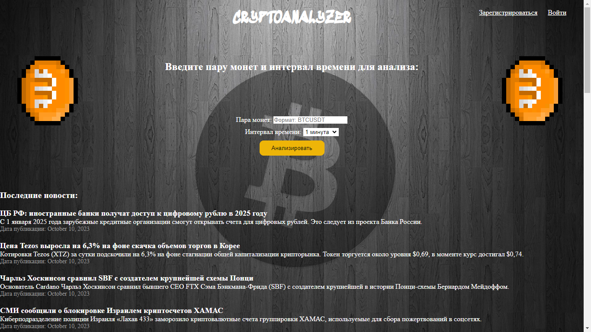
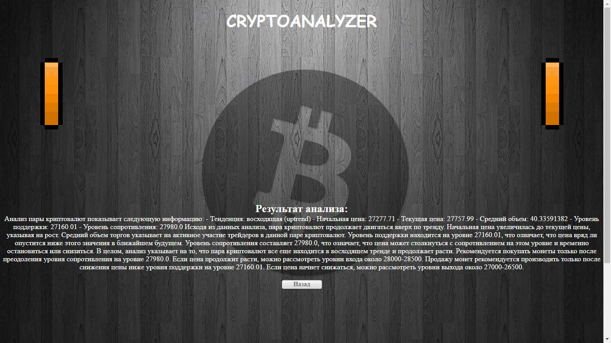

Криптоанализатор: Ваш надежный гид в мире криптовалют

Криптовалюты - это захватывающий, но сложный мир, который может показаться непроходимым для новичков. Криптоанализатор, инновационное веб-приложение, разработанное с целью помочь вам освоить этот мир. Криптоанализатор - это ваш надежный гид в мире криптовалют, который поможет вам анализировать и понимать криптовалюты легко и интуитивно.

Как это работает?
Анализ криптовалют.
Вы начинающий трейдер или инвестор, и вы хотите разобраться в мире криптовалют? Просто введите пару монет и интервал времени в Криптоанализаторе, и он предоставит вам подробный анализ. Какая цена является оптимальной для покупки? Где расположены уровни поддержки? Предоставит вам ответы с помощью высокотехнологичных алгоритмов, разработанных на основе искусственного интеллекта.

Парсинг новостей.
Мир криптовалют меняется быстро, и важно быть в курсе последних событий. Криптоанализатор также предоставляет последние новости о криптовалютах из различных источников. Это позволяет вам принимать обоснованные решения и оставаться впереди рынка.
Технологии.
Стек технологий включает в себя Django, HTML/CSS, API OpenAI для анализа криптовалют, API Binance для получения данных, Celery + RabbitMQ для парсинга новостей, Docker для легкости развертывания и встроенное тестирование с использованием TestCase в Django, а также подробное логгирование для обеспечения прозрачности и надежности.

Почему Криптоанализатор?
Мир криптовалют - это не только финансовые инструменты, но и возможность для личного роста и развития. Я верю, что каждый должен иметь доступ к знаниям и инструментам, которые помогут им принимать обоснованные решения. Криптоанализатор создан с любовью к криптовалютам и стремлением сделать их мир доступным для всех.
